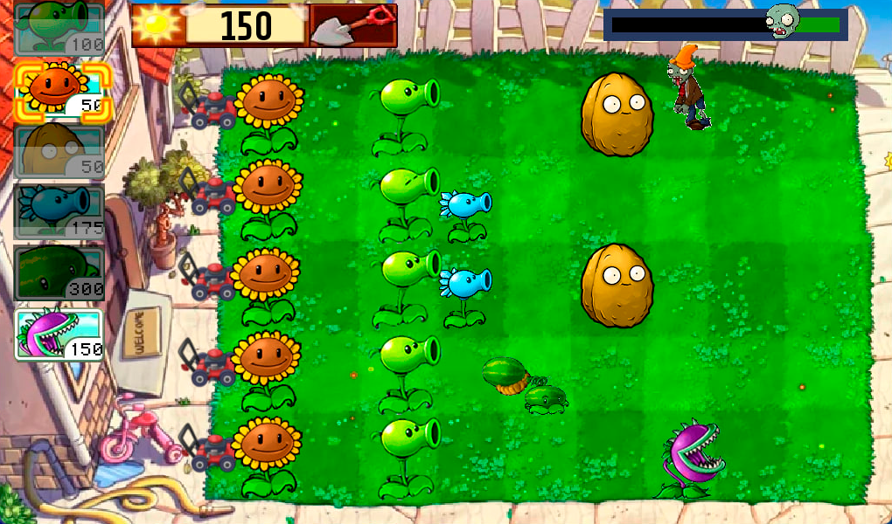
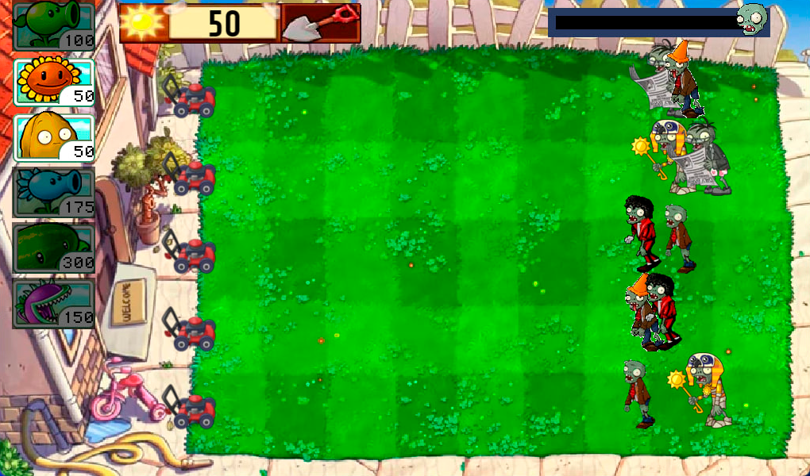
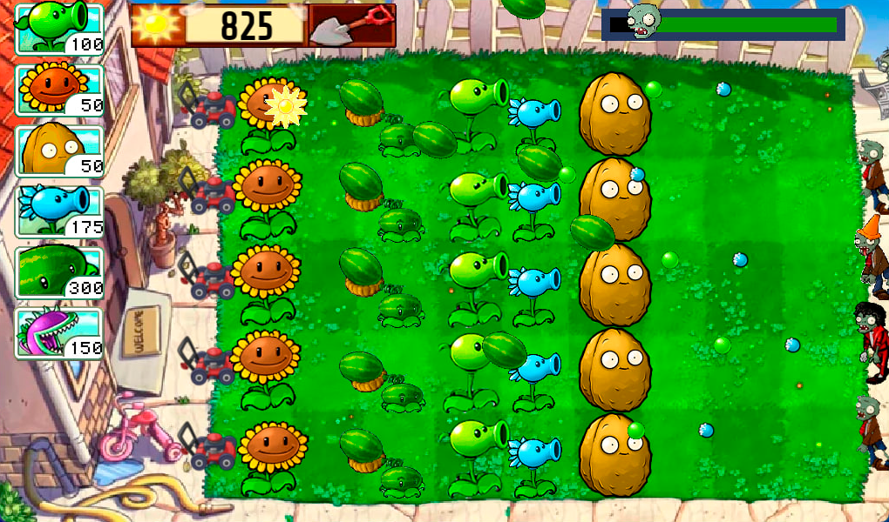
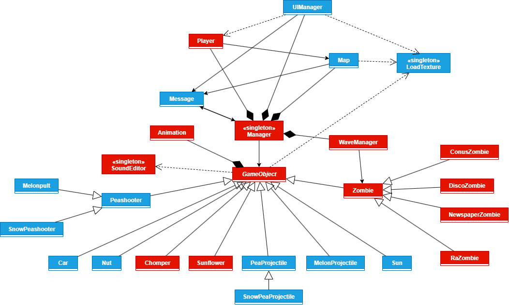

# 🌻 PlantDefense

**PlantDefense** – это клон культовой игры *Plants vs. Zombies*, выполненный в жанре **Tower Defense**.  
Проект написан на языке **C++** с использованием библиотеки **SFML** и принципов **объектно-ориентированного программирования**.

Игроку предстоит защищать свой дом, высаживая разнообразные растения на поле, чтобы остановить наступающие волны зомби.  

---

## 🎮 Особенности игры

- **6 видов растений:**
  - 🌱 *Горохострел* – стандартный атакующий юнит.
  - ❄️ *Снежный горох* – замедляет врагов.
  - 🍉 *Арбузопульт* – наносит большой урон.
  - 🥥 *Орех* – служит защитой.
  - 🌻 *Подсолнух* – производит солнышки (валюту).
  - 🦷 *Чомпер* – поедает зомби вблизи.

- **5 видов зомби:**
  - 🧟 *Обычный*
  - 🧢 *С конусом* – имеет броню.
  - 📰 *С газетой* – ускоряется при потере газеты.
  - 🌞 *Ра зомби* – притягивает и крадёт солнышки.
  - 💃 *Диско зомби* – призывает дополнительных зомби вокруг себя при достижении центра поля.

- **Игровая карта:**
  - Классический уровень с 5 горизонтальными линиями.
  - Газонокосилки, дающие второй шанс.
  - Падающие с неба и появляющиеся от подсолнухов солнышки.
  - Визуальные направляющие при посадке растений.

- **Пользовательский интерфейс:**
  - Иконки растений с перезарядкой, затемнением при нехватке ресурсов.
  - Выбор лопаты для удаления растений.
  - Прогресс-бар волн зомби.
  - Подсчёт и отображение собранных солнышек.

- **Игровой процесс:**
  - Всего реализовано **20 волн зомби**.
  - При поражении проигрышная анимация. Победа не останавливает игру, но новые зомби не появляются.

- **Звук и анимации:**
  - Звуки взаимодействий и событий.
  - Анимированные спрайты растений, зомби, снарядов и прочего.

- **Конфиг-файл:**
  - Для настройки параметров (скорости, урона, таймингов и т.п.)

---

## 📸 Скриншоты

### Посадка растений


### Появление волны


### Столкновение снарядов и зомби


---

## 🧩 Архитектура проекта

Проект построен на **объектно-ориентированной архитектуре** с обменом сообщениями между объектами:
- GameObject – базовый класс всех игровых сущностей (растения, зомби, пули, солнца, газонокосилки и др.).
- Manager (синглтон) – управляет всеми подсистемами: UIManager, Map, WaveManager, Player и др.
- Message – система взаимодействия между объектами (смерть, урон, создание и т.п.).
Этот подход позволяет легко масштабировать и управлять игрой, обеспечивая низкую связанность компонентов.

---

## 📐 Диаграмма классов

Ниже представлена диаграмма классов проекта, демонстрирующая зависимости между основными сущностями игры.

- 🟦 Синим цветом обозначены классы, реализованные **CTTAPTAH**.
- 🟥 Красным — классы, реализованные **DmitriiJFH**.

### Основная диаграмма


> 💡 Подробная версия с полями и методами доступна [здесь](diagrams/class_diagram_full.png).

---

## ⚙️ Технологии

- C++
- [SFML](https://www.sfml-dev.org/)
- ООП (наследование, композиция, зависимости)
- Visual Studio (для сборки)
- GitHub (для совместной разработки)

---
## ▶️ Запуск

1. Склонируйте репозиторий:
```bash
git clone https://github.com/CTTAPTAH/PlantDefense.git
```
2. Откройте проект в Visual Studio
3. Нажмите F5 для запуска
> 💡 Все необходимые ресурсы (текстуры, конфиг, звуки) уже включены в проект.

---

## 👥 Авторы

- CTTAPTAH
- DmitriiJFH

---

## 📄 Лицензия

Этот проект распространяется по лицензии MIT.
Подробнее — см. файл [LICENSE](LICENSE).